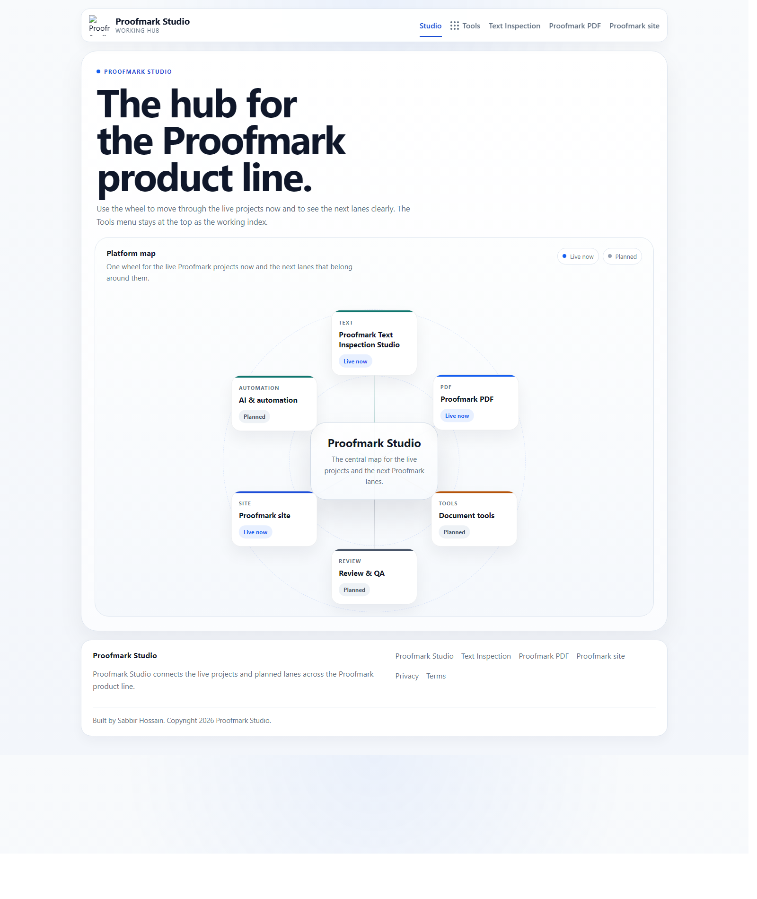

# ProofMark Studio

The working hub for the ProofMark product line. One catalog of ~50 document-craft tools, rendered as a React SPA on top of a thin FastAPI shell.



## Quickstart

```powershell
cd C:\Users\sabbir\Dev\GitHub\tools\proofmark-studio
.\run-all.cmd                 # boots hub + sibling apps, opens browser at :8020
```

Ctrl+C cleans everything up.

**Individual pieces** (for isolated dev):

```powershell
# Hub only (no PDF or Text apps)
.\run.py

# Sibling apps standalone (from their own folders)
cd ..\proofmark-pdf   && python web_app.py    # :8010
cd ..\text-cleaner    && python web_app.py    # :8000
```

## Architecture

Three sibling FastAPI apps, one domain from the user's perspective. Hub connects via **URL**, not via imports — so each sibling stays independently editable, deployable, and testable.

```
┌────────────────────────────────┐
│  proofmark-studio (:8020)      │  React SPA + catalog + stubs
│  /tool/{slug} router           │─┐
└────────────────────────────────┘ │
         ▲                         │ 307 redirect for live tools
         │  "← ProofMark Studio"   │
         │                         ▼
┌────────────────────────┐  ┌────────────────────────┐
│ proofmark-pdf (:8010)  │  │ text-cleaner (:8000)   │
│ merge, split, extract  │  │ hidden chars, typog    │
└────────────────────────┘  └────────────────────────┘
```

**Port map:**

| App              | Port | Folder                    | Launch script         |
|------------------|------|---------------------------|------------------------|
| Hub              | 8020 | `proofmark-studio/`       | `run.py`               |
| ProofMark PDF    | 8010 | `../proofmark-pdf/`       | `python web_app.py`    |
| Text Inspection  | 8000 | `../text-cleaner/`        | `python web_app.py`    |

Sibling apps receive `PROOFMARK_HUB_URL=http://127.0.0.1:8020` from the launcher; this toggles the "← ProofMark Studio" back-link in their topbar. Unset → no link (clean standalone mode).

## Tool catalog

**Live** (wired end-to-end):
- `merge-pdf`, `split-pdf`, `extract-pdf-pages` → ProofMark PDF
- `text-inspection`, `inspect-hidden`, `normalize-whitespace`, `review-typography`, `export-cleanup-report` → Text Inspection

**Beta** (visible with "Beta" badge; click opens stub page):
- `organize-pdf`, `pdf-to-jpg`, `pdf-annotator`, `ai-pdf-assistant`, `chat-with-pdf`, `ai-pdf-summarizer`

**Planned** (stub page with "Return to hub" + "Open parent tool"):
- 35 additional slots pre-registered. Each is a line in `proofmark_studio/tool_registry.py` and `static/hub/src/tools.jsx`.

See [docs/adding-a-tool.md](docs/adding-a-tool.md) for the recipe to promote a planned tool to beta or live.

## Key files

| File                                              | Purpose                                                          |
|---------------------------------------------------|------------------------------------------------------------------|
| `proofmark_studio/hub_app.py`                     | FastAPI app — serves SPA, `/tool/{slug}` router, stubs, APIs     |
| `proofmark_studio/tool_registry.py`               | Single source of truth for `{status, url, parent}` per slug      |
| `proofmark_studio/static/hub/index.html`          | SPA shell (grid-bg removed, studio-canvas added)                 |
| `proofmark_studio/static/hub/src/app.jsx`         | Main React app (sidebar, tool drawer, palette)                   |
| `proofmark_studio/static/hub/src/tools.jsx`       | Display metadata for tiles                                       |
| `proofmark_studio/static/hub/src/studio-canvas.jsx` | Abstract art background layer                                  |
| `scripts/launch-all.ps1`                          | Multi-process launcher (start / stop / status / restart)         |

## Testing

```powershell
.\.venv\Scripts\python -m pytest         # hub tests (17 tests)
```

Sibling test suites run from their own folders:

```powershell
cd ..\proofmark-pdf && .\.venv\Scripts\python -m pytest   # 87 tests
cd ..\text-cleaner  && .\.venv\Scripts\python -m pytest   # 69 tests
```

**Total: 173 tests** across the three apps.

## Deployment (preview — Phase 9)

Production plan: three Vercel projects, one public domain (`proofmarkstudio.com`).
Hub's `vercel.json` rewrites `/pdf/*` and `/text/*` to the sibling Vercel projects via edge proxy.
Users see only `proofmarkstudio.com` in their URL bar — SmallPDF-style seamless UX.
See plan file for details.

## Theme

Dark console (default) and light editorial themes, toggleable via the spark icon in the topbar.
Art background opacity auto-adapts to theme (0.14 dark, 0.22 light).
