# ProofMark Studio

The working hub for the ProofMark product line — one keyboard-first catalog of document-craft tools, rendered as a React SPA on top of a thin FastAPI shell.

> **Catalog:** 49 tools registered · **27 live** end-to-end · 14 beta · 8 planned.
> **Live URL:** _coming on `proofmarkstudio.com` (Phase 19)_ — currently at the [Vercel preview](https://proofmark-studio-ij7v4i8xk-sabbirs-projects-eab46ba9.vercel.app/).


---

## Why this exists

Document workflows fragment across a dozen single-purpose websites — merge here, sign there, OCR somewhere else, with watermarks, account walls, and a different UX every time. ProofMark Studio composes a single hub over independent sibling apps so users get one catalog, one navigation model, and tools that actually work end-to-end.

**Design constraints we hold ourselves to:**

- **Composition over monolith.** Each sibling (PDF, Text Inspection, AI, Workflow) is its own FastAPI repo with its own tests and release cadence. The hub routes and redirects, nothing more.
- **Live-only catalog.** Users see only tiles that work. Beta and planned tiles stay in the registry for the roadmap but are hidden from every public surface unless a roadmap-mode env var is flipped.
- **Per-tool kill switch.** Every tile is gated by `TOOL_<SLUG>_ENABLED`. Bad deploy → flip env var → tile demotes in ≤ 60s, no redeploy.
- **Observability by default.** Every decision point logs `[tag] message`. Silent failures have nowhere to hide.

---

## Screenshots

### Catalog & navigation

| Home | All tools |
|---|---|
|  | 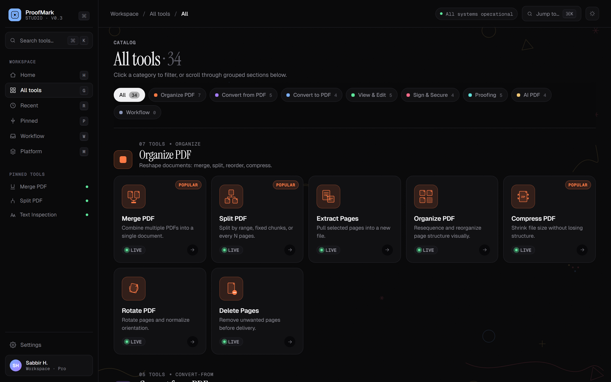 |

| Command palette (Cmd/Ctrl + K) | Keyboard shortcuts (`?`) |
|---|---|
| 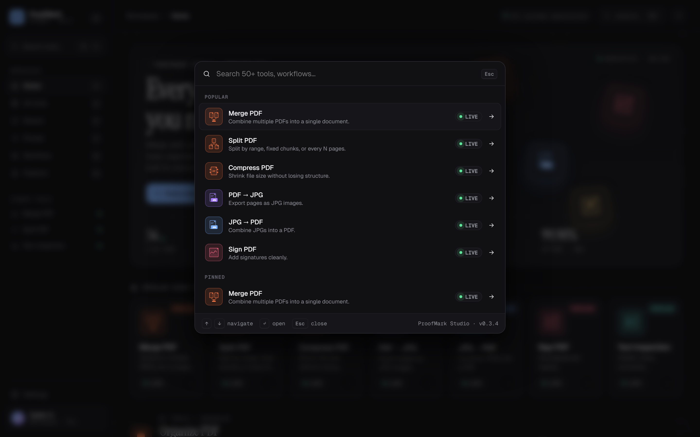 | 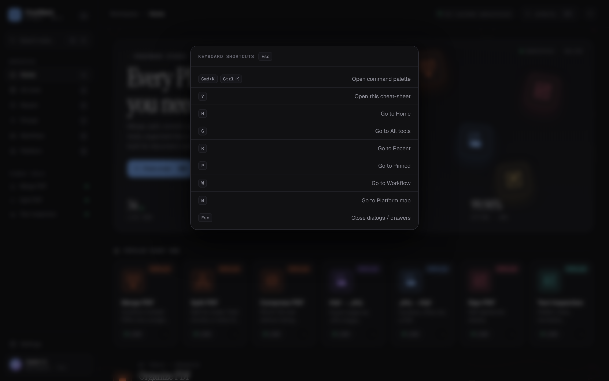 |

### Live tools (real working sibling apps)

| Merge PDF (`proofmark-pdf` :8010) | PDF → Text |
|---|---|
| 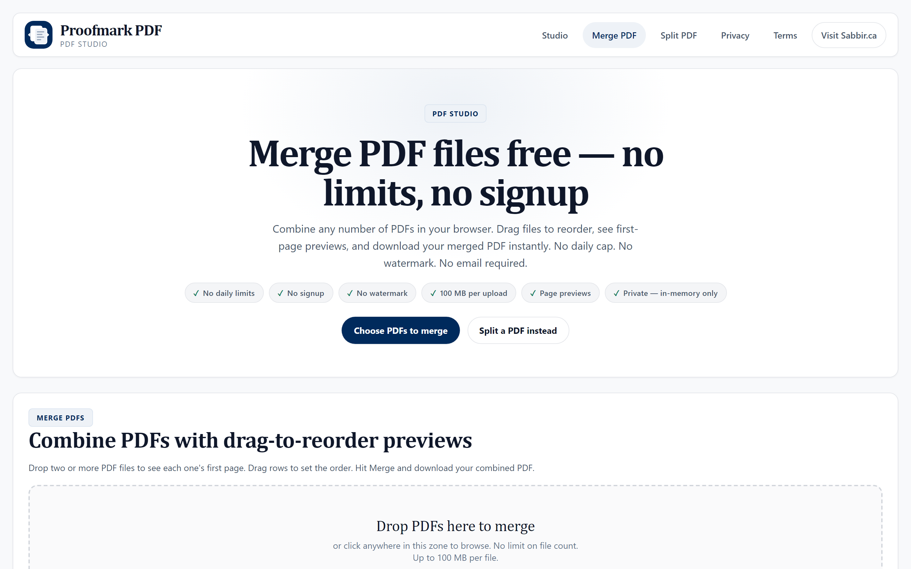 | 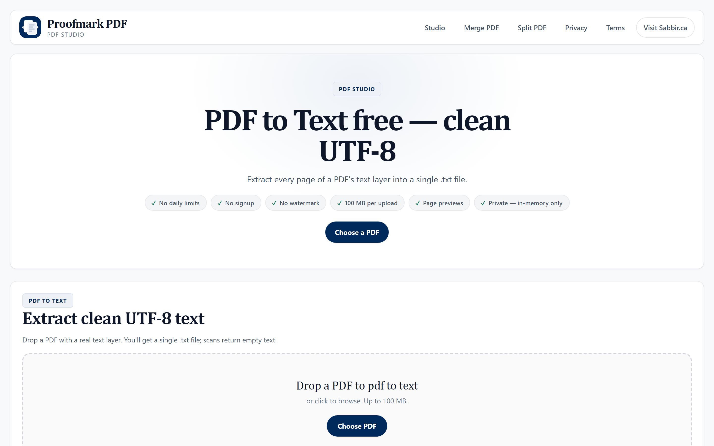 |

| Text Inspection (`text-cleaner` :8000) |
|---|
| 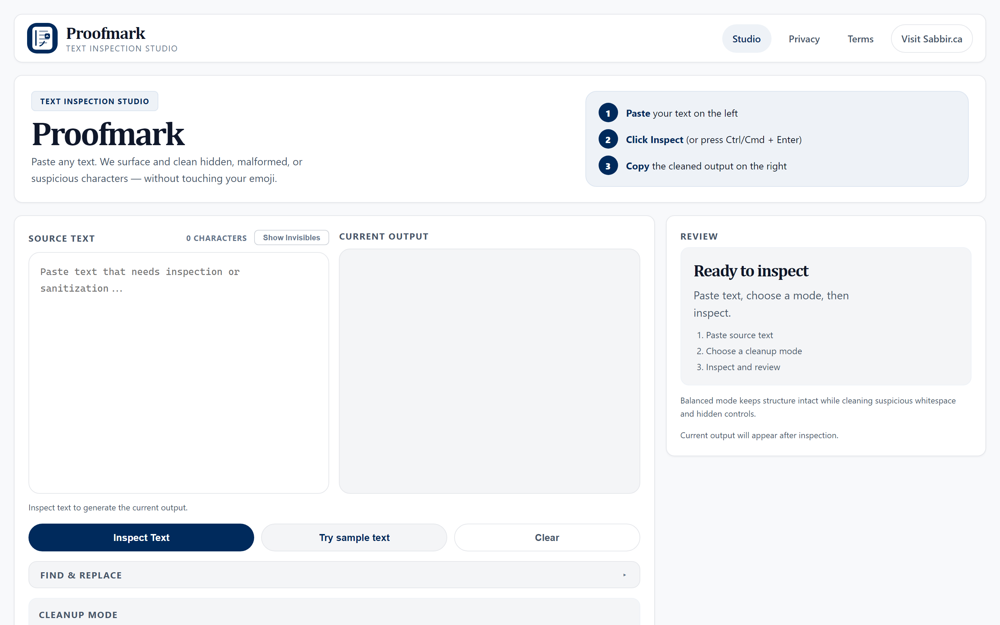 |

### Static pages

| About | Changelog |
|---|---|
| 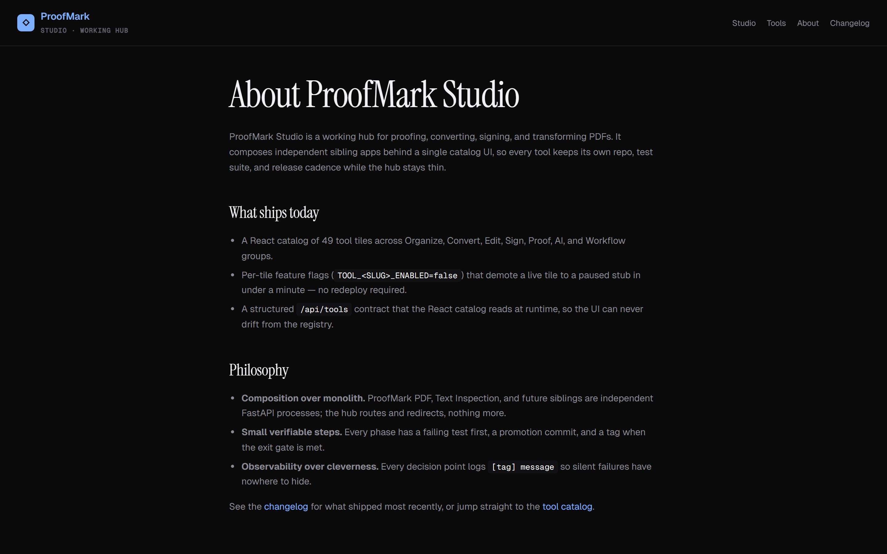 | 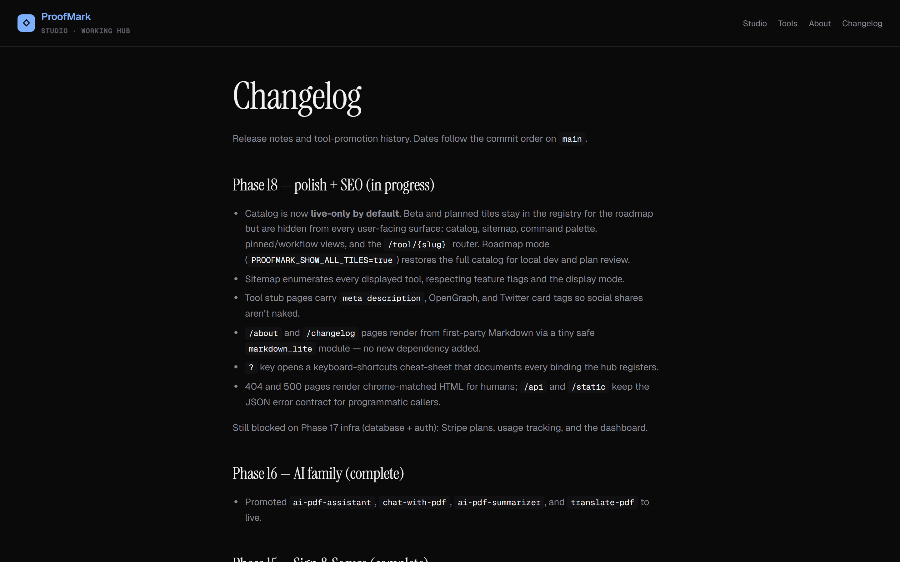 |

### Error chrome

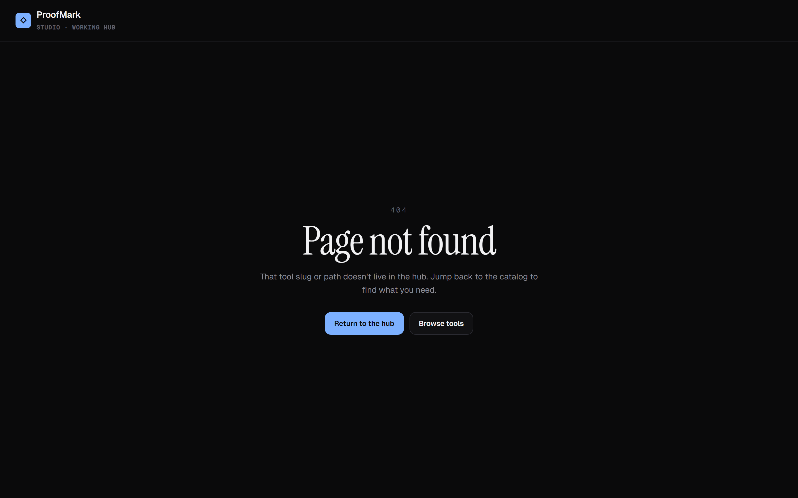

### Dynamic OpenGraph cards

Every tool gets its own social-share card at `/og/<slug>.png` (1200×630). Brand-level fallback at `/og/proofmark-studio.png` covers `/`, `/about`, and `/changelog`. Group color tints the accent stripe and status pill.

| Brand card | Tool card · Organize tone | Tool card · Sign tone |
|---|---|---|
| 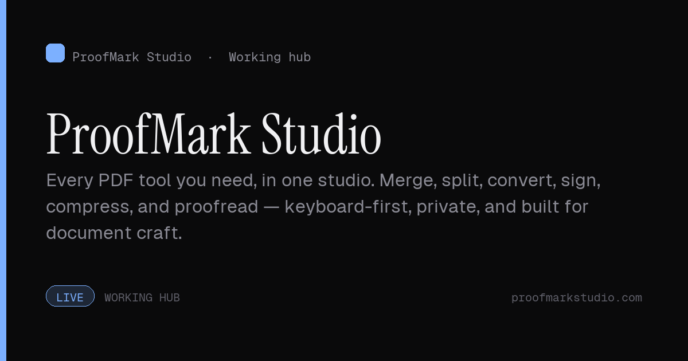 | 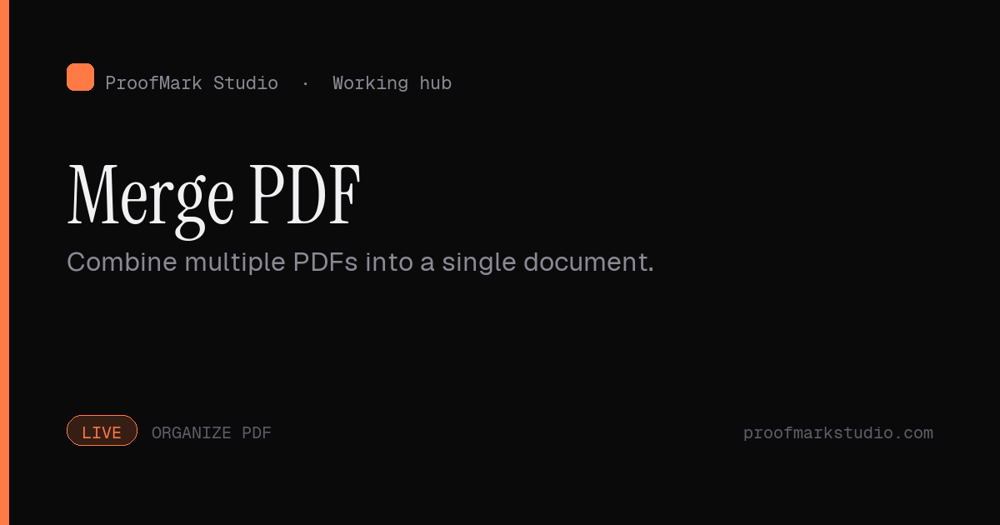 | 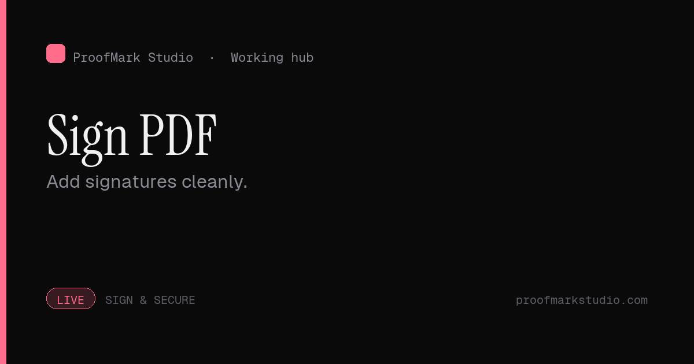 |

### Live-only vs roadmap mode

The catalog defaults to **live-only** — only tools that work end-to-end are visible. Flipping `PROOFMARK_SHOW_ALL_TILES=true` restores the full 49-tile catalog for plan review.

| Live-only (default) — `display_counts: 27/0/0` | Roadmap mode — all 49 tiles |
|---|---|
|  |  |

---

## Quickstart

```powershell
# from C:\Users\sabbir\Dev\GitHub\tools\proofmark-studio
.\run-all.cmd                 # boots hub + sibling apps, opens browser at :8020
```

Ctrl + C cleans every process up.

**Individual pieces** (for isolated dev):

```powershell
# Hub only (no PDF or Text apps — tile redirects will fail)
python web_app.py

# Sibling apps standalone (from their own folders)
cd ..\proofmark-pdf  && python web_app.py    # :8010
cd ..\text-cleaner   && python web_app.py    # :8000
```

**Roadmap mode** — show every registered tile, including beta and planned:

```powershell
$env:PROOFMARK_SHOW_ALL_TILES = "true"
.\run-all.cmd
```

---

## Architecture

Three sibling FastAPI apps; one domain from the user's perspective. The hub talks to siblings via **URL**, not via imports — so each sibling stays independently editable, deployable, and testable.

```
┌────────────────────────────────┐
│  proofmark-studio (:8020)      │  React SPA + catalog + stubs
│  /tool/{slug} router           │─┐
└────────────────────────────────┘ │
         ▲                         │ 307 redirect for live tools
         │  "← ProofMark Studio"   │
         │                         ▼
┌────────────────────────┐  ┌────────────────────────┐
│ proofmark-pdf (:8010)  │  │ text-cleaner  (:8000)  │
│ merge, split, OCR …    │  │ hidden chars, typog    │
└────────────────────────┘  └────────────────────────┘
```

| App              | Port | Folder                    | Launch script         |
|------------------|------|---------------------------|------------------------|
| Hub              | 8020 | `proofmark-studio/`       | `python web_app.py`    |
| ProofMark PDF    | 8010 | `../proofmark-pdf/`       | `python web_app.py`    |
| Text Inspection  | 8000 | `../text-cleaner/`        | `python web_app.py`    |

Sibling apps receive `PROOFMARK_HUB_URL=http://127.0.0.1:8020` from the launcher; this toggles the "← ProofMark Studio" back-link in their topbar. Unset → no link (clean standalone mode).

---

## Tool catalog

### Live (27) — work end-to-end on Vercel

**Organize** — merge-pdf, split-pdf, extract-pdf-pages, organize-pdf, compress-pdf, rotate-pdf, delete-pdf-pages
**Convert from PDF** — pdf-to-jpg, pdf-to-png, pdf-to-text, pdf-to-markdown, pdf-to-html
**Convert to PDF** — jpg-to-pdf
**View & Edit** — number-pages, crop-pdf, redact-pdf, watermark-pdf, pdf-form-filler
**Sign & Secure** — sign-pdf, unlock-pdf, protect-pdf, flatten-pdf
**Proofing** — text-inspection, inspect-hidden, normalize-whitespace, review-typography, export-cleanup-report

### Beta (14) — hidden by default

Stays in the registry for the roadmap. Visible only with `PROOFMARK_SHOW_ALL_TILES=true`.

- Convert to PDF: `html-to-pdf`, `markdown-to-pdf` (need xhtml2pdf which needs Cairo C libs — not on Vercel), `pdf-ocr` (needs tesseract — not on Vercel)
- AI — `ai-pdf-assistant`, `chat-with-pdf`, `ai-pdf-summarizer`, `translate-pdf` (call Anthropic; pending per-IP rate limit + budget alarm)
- Office → PDF: `word-to-pdf`, `excel-to-pdf`, `ppt-to-pdf` (require self-hosted LibreOffice)
- View & Edit: `edit-pdf`, `pdf-annotator`, `pdf-reader`
- Sign & Secure: `request-signatures`

### Planned (8) — registered slots

- Convert from PDF: `pdf-to-word`, `pdf-to-excel`, `pdf-to-ppt`
- Workflow: `project-intake`, `review-queue`, `delivery-center`, `standards-library`, `publishing-hub` (blocked on Phase 17 DB + auth)

See [docs/adding-a-tool.md](docs/adding-a-tool.md) for the recipe to promote a planned tool.

---

## Feature flags

Two layers of runtime control, both keyed to env vars (no redeploy needed):

| Flag | Scope | Default | Effect |
|---|---|---|---|
| `TOOL_<SLUG>_ENABLED` | Per-tool | `on` | `false` / `0` / `off` demotes the tile to a "paused" stub. |
| `PROOFMARK_SHOW_ALL_TILES` | Catalog | `false` | When truthy, beta + planned tiles return to the catalog, sitemap, palette, and `/tool/{slug}` router. |

Full reference: [docs/feature-flags.md](docs/feature-flags.md).

---

## Keyboard shortcuts

Press **`?`** anywhere to open the cheat-sheet (illustrated above). Quick reference:

| Key | Action |
|---|---|
| `Cmd/Ctrl + K` | Open command palette |
| `?` | Open shortcuts cheat-sheet |
| `H` / `G` / `R` / `P` / `W` / `M` | Jump to Home / All tools / Recent / Pinned / Workflow / Platform map |
| `Esc` | Close any open dialog or drawer |

---

## Key files

| File                                                 | Purpose                                                               |
|------------------------------------------------------|-----------------------------------------------------------------------|
| `proofmark_studio/hub_app.py`                        | FastAPI app — SPA, `/tool/{slug}` router, stubs, error pages, APIs    |
| `proofmark_studio/tool_registry.py`                  | Single source of truth for `{status, url, parent}` per slug           |
| `proofmark_studio/feature_flags.py`                  | `is_enabled`, `is_displayed`, `show_all_tiles`                        |
| `proofmark_studio/markdown_lite.py`                  | Tiny safe Markdown subset for `/about` and `/changelog`               |
| `proofmark_studio/static/hub/src/app.jsx`            | Main React app — sidebar, tool drawer, palette, shortcuts modal       |
| `proofmark_studio/static/hub/src/tools.jsx`          | Display metadata for tiles (kept in lockstep with `tool_registry.py`) |
| `proofmark_studio/static/hub/src/studio-canvas.jsx`  | Abstract art background layer                                         |
| `scripts/launch-all.ps1`                             | Multi-process launcher (start / stop / status / restart)              |
| `scripts/screenshot.py`                              | Playwright-driven README screenshot capture                           |

---

## Testing

```powershell
.\.venv\Scripts\python -m pytest         # hub tests (54 tests)
```

Sibling test suites run from their own folders:

```powershell
cd ..\proofmark-pdf && .\.venv\Scripts\python -m pytest   # ~87 tests
cd ..\text-cleaner  && .\.venv\Scripts\python -m pytest   # ~69 tests
```

**Total: ~210 tests** across the three apps.

Re-capturing the README screenshots after a UI change:

```powershell
.\run-all.cmd                                   # in one terminal
.\.venv\Scripts\python scripts\screenshot.py    # in another
```

---

## Deployment

- Hub deploys to Vercel (`proofmark-studio` project). Sibling apps deploy to their own Vercel projects.
- Hub's `vercel.json` rewrites `/pdf/*` and `/text/*` to the sibling Vercel projects via edge proxy. Users see only the hub origin in their URL bar — SmallPDF-style seamless UX.
- Custom domain (`proofmarkstudio.com`) cuts over in Phase 19.

---

## Theme

Dark console (default) and light editorial themes, toggleable via the spark icon in the topbar. Art background opacity auto-adapts to theme (0.14 dark, 0.22 light).

---

## See also

- [docs/architecture.md](docs/architecture.md) — full architecture reference
- [docs/feature-flags.md](docs/feature-flags.md) — every env var, behaviour matrix
- [docs/adding-a-tool.md](docs/adding-a-tool.md) — recipe to register a new tool
- [docs/observability.md](docs/observability.md) — log-tag conventions
- [docs/changelog.md](docs/changelog.md) — what shipped, when, why
- [tasks/todo.md](tasks/todo.md) — phase plan with checkable items
